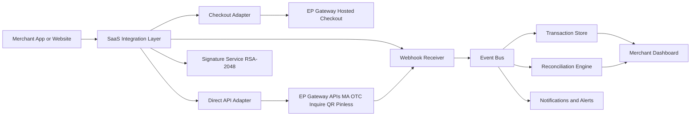

# Option 2: SaaS Package/Tier Design for EP Gateway Integration

Date: 2026-05-04
Status: Draft v1.0 (implementation ready)
Scope: Productized EP Gateway integration delivered as SaaS packages

## 1. Executive Summary

This document defines a complete product and technical design for integrating EP Gateway into your SaaS using a package/tier strategy.

Primary objective:
- Offer a fast-to-adopt package for SMBs.
- Offer configurable API-first package for mid-market.
- Offer enterprise-grade controls, security, and custom orchestration for large tenants.

Design principle:
- Single platform, multi-tenant by default.
- Progressive capability unlock by tier, not separate codebases.

## 2. Business Goals and Success Criteria

1. Reduce integration lead time from weeks to days for most customers.
2. Increase payment conversion via MA/OTC/checkout and optional QR/pinless modules.
3. Minimize support load through standardized onboarding, webhooks, and reconciliation.
4. Enable enterprise upsell with secure direct APIs and governance controls.

Success KPIs:
- Time to first successful transaction (TTFST):
  - Starter: <= 1 business day
  - Growth: <= 3 business days
  - Enterprise: <= 7 business days
- Payment success rate: >= 98.5% (excluding user abandonment)
- Webhook delivery success: >= 99.9% within retry window
- Auto-reconciliation closure (same day): >= 97%

## 3. SaaS Packages (Option 2)

Package definitions:
1. Starter
- Target: SMB web merchants
- Integration mode: Hosted checkout only
- Security mode: Credential/header flow where applicable
- Features: Postback + IPN listener, dashboard status, basic reconciliation

2. Growth
- Target: Growing digital businesses and app-first merchants
- Integration mode: Hosted checkout + Direct REST (MA/OTC/Inquire)
- Security mode: Credential flow and optional RSA mode
- Features: API access, callback controls, retries, advanced reconciliation, basic analytics

3. Enterprise
- Target: High volume merchants and regulated organizations
- Integration mode: Full direct API orchestration + optional hosted fallback
- Security mode: Mandatory RSA-2048 signing and verification where supported
- Features: QR module, pinless MA precheck, custom routing, fine-grained RBAC, audit and SLO controls

## 4. Tier Feature Matrix

| Capability | Starter | Growth | Enterprise |
|---|---|---|---|
| Hosted Checkout (JS/iFrame) | Yes | Yes | Yes |
| MA Direct API | No | Yes | Yes |
| OTC Direct API | No | Yes | Yes |
| Inquire Transaction API | Yes (internal only) | Yes | Yes |
| RSA key management | No | Optional | Required |
| QR API | No | Add-on | Yes |
| Pinless MA Precheck | No | Add-on | Yes |
| IPN/Webhook management | Basic | Advanced | Advanced + signed verification |
| Retry + dead-letter queue | Basic | Yes | Yes |
| Multi-store / multi-region config | Limited | Yes | Yes |
| Reconciliation dashboard | Basic | Advanced | Advanced + downloadable evidence |
| SLA commitment | Best effort | Standard SLA | Premium SLA |

## 5. Product Modules

Core modules for all tiers:
1. Merchant Onboarding
2. Payment Orchestration
3. Callback/IPN Receiver
4. Transaction Store
5. Reconciliation Engine
6. Operations Dashboard

Enterprise modules:
1. RSA Key and Signature Service
2. QR Service Adapter
3. Pinless Token/Precheck Adapter
4. Policy and Access Control (RBAC + approvals)
5. Audit and Compliance Export

## 6. Reference Architecture

Architecture notes:
1. Adapters isolate EP protocol details from SaaS domain services.
2. IPN and postback are handled as events, not direct state writes.
3. Reconciliation is event-first with scheduled inquiry fallback.

## 7. Canonical Transaction Lifecycle

Transaction states:
1. CREATED
2. INITIATED
3. PENDING
4. SUCCESS
5. FAILED
6. EXPIRED
7. REVERSED
8. UNKNOWN (temporary only)

State transition rules:
1. Only async callback or signed inquiry response can finalize SUCCESS/FAILED/REVERSED.
2. Duplicate events must be idempotent by eventId and transactionId.
3. UNKNOWN must trigger inquiry job and timeout policy.

## 8. Internal API Contracts (SaaS)

1. Create payment intent
- Endpoint: POST /v1/payments/intents
- Input: tenantId, orderId, amount, currency, channelPreference, customerRef
- Output: intentId, checkoutUrl or apiToken, expiresAt

2. Initiate direct transaction
- Endpoint: POST /v1/payments/transactions
- Input: intentId, method (MA/OTC/QR/PINLESS), metadata
- Output: transactionId, providerReference, nextAction

3. Inquire transaction
- Endpoint: GET /v1/payments/transactions/{transactionId}
- Output: currentState, providerState, timestamps, reconciliationState

4. Receive callback/IPN
- Endpoint: POST /v1/payments/callbacks/ep
- Behavior: verify signature if enabled, persist event, ack quickly, process async

5. Retry callback delivery to merchant
- Endpoint: POST /v1/merchants/{merchantId}/callbacks/replay
- Input: fromTime, toTime, statusFilter

## 9. Data Model

Primary entities:
1. Tenant
2. MerchantAccount
3. IntegrationProfile
4. PaymentIntent
5. PaymentTransaction
6. ProviderEvent
7. ReconciliationRecord
8. SettlementRecord
9. ApiCredential
10. RsaKeyProfile
11. AuditLog

Key constraints:
1. Unique (tenantId, orderId)
2. Unique providerReference when present
3. Immutable ProviderEvent payload storage

## 10. Security and Compliance Design

1. Secrets management
- Store credentials and private keys in secure vault.
- Never persist decrypted secrets in logs.

2. RSA operations
- Use RSA-2048 for signing and verification where required.
- Key rotation policy every 180 days or immediate on incident.

3. Transport and access
- TLS enforced end-to-end.
- IP allowlist support for callback endpoint.
- Service-to-service auth with short-lived tokens.

4. Auditability
- Every credential/key operation writes immutable audit events.
- Evidence export for compliance reviews.

## 11. Reliability, SLOs, and Operational Policy

SLOs:
1. API availability: 99.9% monthly (Growth and Enterprise)
2. Callback processing latency p95: < 60 seconds
3. Reconciliation completion for previous day: by 08:00 local time

Retry policy:
1. Callback retries at 1m, 5m, 15m, 60m, 6h
2. Inquiry retries with exponential backoff and max-attempt threshold
3. Dead-letter queue for manual or scheduled replay

## 12. Tier-Specific Onboarding Journeys

Starter onboarding:
1. Merchant signs up
2. Enters storeId and credential set
3. Configures postback/callback URL
4. Runs test transaction and go-live checklist

Growth onboarding:
1. All Starter steps
2. Enable direct API module
3. Configure method enablement (MA/OTC)
4. Validate inquiry and fallback rules

Enterprise onboarding:
1. All Growth steps
2. Upload and validate RSA public key exchange workflow
3. Configure QR and pinless modules if contracted
4. Configure RBAC, audit export, SLA contacts, and incident channels

## 13. Pricing and Packaging Blueprint

Suggested packaging model:
1. Platform fee by tier
2. Transaction fee by payment channel
3. Add-on fees for QR and pinless modules
4. Premium support and SLA add-on for Enterprise

Indicative commercial levers:
1. Volume discount bands
2. Multi-merchant bundle pricing
3. Annual commitment discount

## 14. Implementation Roadmap

Phase 1 (4-6 weeks):
1. Starter package GA
2. Hosted checkout, callbacks, dashboard, basic reconciliation

Phase 2 (4-6 weeks):
1. Growth package GA
2. Direct MA/OTC APIs, inquiry services, advanced reconciliation

Phase 3 (6-8 weeks):
1. Enterprise package GA
2. RSA security service, QR, pinless precheck, governance controls

Phase 4 (2-3 weeks):
1. Hardening
2. Load testing, failover drills, runbook sign-off

## 15. Test Strategy

1. Unit tests
- Signature generation/verification
- State machine transitions
- Idempotency enforcement

2. Integration tests
- Hosted and direct mode flows
- Callback retries and replay
- Reconciliation against synthetic drift scenarios

3. Non-functional tests
- Performance under peak throughput
- Secret/key rotation drills
- Disaster recovery simulation

## 16. Release Readiness Checklist

1. All contracted payment channels validated in staging
2. Callback authenticity and replay protection verified
3. Reconciliation exceptions dashboard operational
4. Alerting connected to on-call channels
5. Support playbooks approved by operations

## 17. Risks and Mitigations

1. Endpoint mismatch between documents and actual tenant setup
- Mitigation: environment-based config and pre-go-live smoke suite

2. Callback loss or delay
- Mitigation: durable queue, replay endpoint, inquiry fallback job

3. Signature validation drift
- Mitigation: strict canonicalization library with regression vectors

4. Duplicate transactions by client retries
- Mitigation: idempotency keys at intent and transaction levels

## 18. Decision Record

Selected approach:
- Option 2 package strategy (Starter, Growth, Enterprise)

Why selected:
1. Supports broad customer base with controlled complexity.
2. Creates clear upsell path without architecture fork.
3. Aligns with observed EP capabilities across hosted/direct/RSA/QR/pinless flows.

## 19. Next Immediate Actions

1. Confirm exact production/staging EP endpoints with onboarding team.
2. Freeze channel availability by tier in commercial terms.
3. Finalize callback payload schema and signature verification policy.
4. Start Phase 1 implementation with Starter scope.
