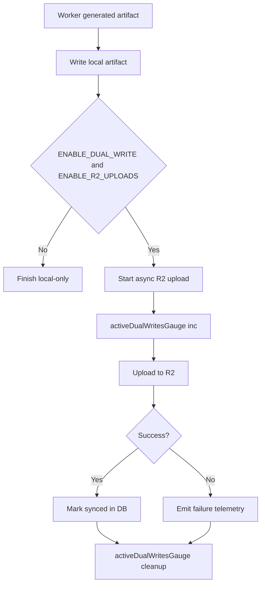
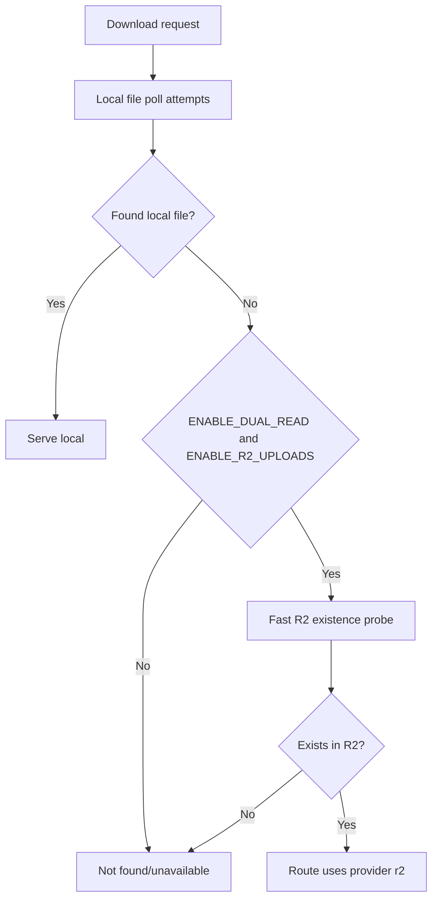

# Storage Rollout Architecture (Final Implemented State)

## Purpose

This document is the source of truth for the label/money-order storage rollout architecture and the exact runtime behavior currently implemented.

## Non-Negotiable Runtime Rules

- Local storage is authoritative for write path and first read path.
- R2 is optional mirror/fallback controlled by feature flags.
- Feature flags are disabled by default.
- Rollback must be operationally safe without schema changes.
- Download fallback must remain streaming-safe.

## Components and Responsibilities

### API (`apps/api`)

- Authenticates and authorizes download requests.
- Resolves artifact path from DB/queue state.
- Runs local-first polling and optional fallback selection.
- Serves local files directly or streams from R2 fallback path.
- Emits stream lifecycle telemetry and updates stream metrics.

### Worker (`apps/api` worker process)

- Generates PDFs and writes local artifacts.
- Performs async dual-write mirror upload to R2 when enabled.
- Updates sync markers after successful R2 upload.
- Emits dual-write telemetry and dual-write gauge snapshots.

### Storage Providers

- `LocalStorageProvider`: authoritative primary store.
- `R2StorageProvider`: optional remote mirror/fallback provider.
- `provider.ts` abstracts provider selection and dual-write orchestration.

### Aggregator Metadata Layer (Phase A)

- `AggregatorQuote` stores optional source object metadata for upstream intake files:
  - `sourceFileKey` and compatibility alias `sourceObjectKey`
  - `sourceBucket`, `sourceSizeBytes`, `sourceContentType`, `sourceChecksum`, `sourceOriginalFilename`, `sourceUploadedAt`
- `AggregatorBookingDocument` stores additive object and local-cleanup metadata:
  - object fields: `bucket`, `objectKey`, `sizeBytes`, `contentType`, `checksum`
  - upload lifecycle: `uploadStatus` (`PENDING`, `R2_SYNCED`, `FAILED`)
  - local cleanup lifecycle: `localTempPath`, `localCleanupStatus`, `localCleanupAttempts`, `localCleanupLastError`, `localCleanupNextRetryAt`
- Phase A is metadata-only and does not change write/read orchestration, generation flow, cleanup cron behavior, or worker behavior.

### Upload Source File R2 Backup (Phase B)

- `LabelJob` gains six additive optional fields:
  - `uploadObjectKey` — R2 object key for the source CSV/XLSX file
  - `uploadBucket` — R2 bucket name recorded at upload time
  - `uploadSyncedAt` — timestamp when R2 backup succeeded
  - `uploadSyncStatus` — `NOT_ATTEMPTED` | `PENDING` | `R2_SYNCED` | `FAILED`
  - `uploadSizeBytes` — byte size of the uploaded source file
  - `uploadOriginalExt` — file extension (`.csv` or `.xlsx`) for key reconstruction
- R2 key format: `uploads/{env}/{jobId}/source{ext}` (e.g. `uploads/production/uuid/source.csv`)
- Source file is uploaded to R2 immediately after the multer disk write and before the BullMQ enqueue, using the same buffer already read for the worker dual-mode payload.
- Feature flag: `ENABLE_UPLOAD_R2_BACKUP=true` to enable. Off by default (zero behavior change when unset).
- R2 upload failure is non-blocking: local `uploadPath` continues to be the authoritative source; job proceeds normally with `uploadSyncStatus=FAILED`.
- Phase B does NOT delete local upload files. Phase C will handle local cleanup after confirmed R2 sync.
- Phase B does NOT change read preference. Phase D will add R2-preferred reads for source files.
- `uploadPath` local field is backward-compatible and unchanged.
- `worker.ts`, `cleanup.ts`, `orders.ts`, PDF templates, MO/MOS/UMO logic, tracking/complaint/billing/auth: NOT TOUCHED.

### Local Upload Cleanup After Confirmed Sync (Phase C)

- Phase C adds metadata-driven cleanup for local upload source files only.
- Cleanup deletes local upload files only when all criteria are true:
  - `uploadSyncStatus = R2_SYNCED`
  - `uploadObjectKey` exists
  - `uploadPath` exists
  - `uploadSyncedAt` is older than grace period
  - cleanup has not already completed
  - retry schedule is due and max attempts not reached
- New cleanup metadata on `LabelJob`:
  - `uploadLocalCleanupStatus`
  - `uploadLocalCleanupAttempts`
  - `uploadLocalCleanupLastError`
  - `uploadLocalCleanupNextRetryAt`
  - `uploadLocalDeletedAt`
- Path safety is mandatory before deletion:
  - resolve canonical target
  - ensure target is inside canonical `uploadsDir()` boundary
  - reject path traversal
  - reject symlink and directories
  - allow deletion only for regular files
- Feature flag: `ENABLE_UPLOAD_LOCAL_CLEANUP_AFTER_R2=true` enables this cleanup pass.
- Grace period env: `UPLOAD_LOCAL_CLEANUP_GRACE_MS` (default `3600000`, floor `60000`).
- Retry env: `UPLOAD_LOCAL_CLEANUP_MAX_ATTEMPTS` (default `5`).
- Rollback is immediate by setting `ENABLE_UPLOAD_LOCAL_CLEANUP_AFTER_R2=false`.
- Phase C does NOT change read preference or queue payload behavior.
- Phase D will handle R2-preferred reads later.

### Controlled R2-Preferred Reads With Local Fallback (Phase D)

- Phase D enables R2-preferred reads only when explicitly enabled by feature flag.
- R2-only read is NOT enabled.
- Local fallback remains mandatory across supported download/read routes.
- Flag behavior:
  - `FORCE_LOCAL_READS=true` always bypasses R2-preferred mode and keeps local-first behavior.
  - `ENABLE_R2_PREFERRED_READS=true` activates R2-preferred mode only where durable metadata exists.
  - If R2 read fails/times out/misses, route must fallback to local.
  - If both fail, route preserves existing error/status behavior.
- Phase D does not modify generation logic, queue payload, cleanup deletion behavior, or business-domain formulas.
- Route coverage targets:
  - jobs labels PDF
  - jobs money order PDF
  - jobs tracking master XLSX
  - tracking result JSON
- Tracking batch master file remains local-first until reliable R2 metadata mapping is available.
- Aggregator booking document routes remain metadata-only in Phase D (no new download endpoint).

## Feature Flags (Exact)

- `STORAGE_PROVIDER`
- `ENABLE_DUAL_WRITE`
- `ENABLE_DUAL_READ`
- `ENABLE_R2_UPLOADS`
- `ENABLE_R2_DOWNLOADS`
- `ENABLE_UPLOAD_R2_BACKUP` — Phase B: back up uploaded CSV/XLSX source files to R2 (non-blocking, default off)
- `ENABLE_UPLOAD_LOCAL_CLEANUP_AFTER_R2` — Phase C: delete local upload source files only after confirmed R2 sync (default off)
- `ENABLE_R2_PREFERRED_READS` — Phase D: enable controlled R2-preferred reads with mandatory local fallback (default off)
- `FORCE_LOCAL_READS` — Phase D emergency rollback override to force local-first reads (default off)

### Intended Local-First Rollout Usage

- Keep `STORAGE_PROVIDER=local` for staged fallback rollout.
- Use `ENABLE_DUAL_WRITE` + `ENABLE_R2_UPLOADS` to mirror writes.
- Use `ENABLE_DUAL_READ` + `ENABLE_R2_UPLOADS` to allow local-miss fallback reads.

## Environment Variables and Credential Aliases

### Canonical runtime credential resolution

- Access key resolves from: `R2_ACCESS_KEY_ID` or fallback alias `R2_ACCESS_KEY`
- Secret key resolves from: `R2_SECRET_ACCESS_KEY` or fallback alias `R2_SECRET_KEY`

### Other required R2 settings

- `R2_BUCKET`
- `R2_ENDPOINT`
- Optional: `R2_REGION` (defaults to `auto`)

### Startup validation behavior

- Validation checks the same alias-aware credential resolution as runtime provider config.
- This avoids false startup failure when using either legacy or canonical env names.

## Dual-Write Architecture

### Observability points

- `dual_write_start`
- `dual_write_stream_start`
- `dual_write_success`
- `dual_write_failure`
- `dual_write_stream_cleanup`

### Metrics points

- `activeDualWritesGauge` increments when async upload begins.
- Decrements in guaranteed cleanup path for success/failure.
- Negative count prevention uses zero-floor guard.

## Dual-Read Fallback Architecture

### Degraded-mode guarantees

- R2 probe errors/timeouts return false and do not crash process.
- Fallback resolution fails closed to normal not-found/unavailable response patterns.

## Streaming-Safe Download Architecture

- Active label and money-order fallback routes stream from R2 using provider stream API.
- Response body pipeline is backpressure-aware.
- Abort handling and cleanup are done in guaranteed `finally` blocks.

### Stream protections

- Semaphore limits concurrent R2 streams.
- Timeout wrapper protects remote object fetch.
- Stream gauges and telemetry capture lifecycle and cleanup snapshots.

## Cleanup Safety Architecture

- Cleanup scans aged files and excludes active queue/DB references.
- If dual-write is enabled, PDF deletion requires synced markers.
- Scheduled deletion removes artifacts plus related DB records by due time.
- DB connectivity failures are handled safely by skipping cleanup runs.

## Observability Inventory (Implemented)

### Telemetry events

- `dual_write_start`
- `dual_write_stream_start`
- `dual_write_success`
- `dual_write_failure`
- `dual_write_stream_cleanup`
- `dual_read_fallback`
- `provider_fallback`
- `stream_start`
- `stream_success`
- `stream_failure`
- `stream_timeout`
- `stream_abort`
- `stream_cleanup`
- `concurrency_limit_hit`

### Metrics

- `activeR2StreamsGauge`
- `r2StreamDuration`
- `r2StreamFailures`
- `r2ConcurrencyLimitHits`
- `r2TimeoutCounter`
- `r2FailureCounter`
- `activeDualWritesGauge`

## Rollback-Safe Properties

- No schema change required for flag rollback.
- Local authoritative behavior remains intact when flags are off.
- Fallback behavior is removable by toggling flags off.
- Existing routes continue to function in local-only mode.

## Known Non-Blocking Technical Debt

- Queue-hit detection for semaphore contention is best-effort and may undercount edge races.
- Telemetry line cap per process can drop excess events under sustained burst logging.

## See Also

- `docs/rollout/storage-rollout-runbook.md`
- `docs/architecture/system-map.md`
- `docs/rollout/deployment-status.md`
