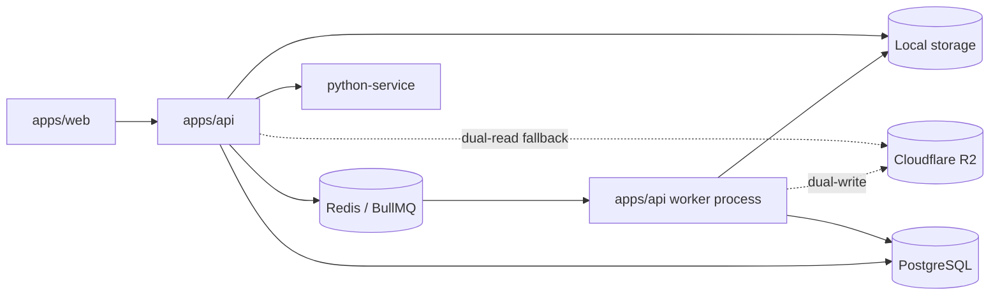
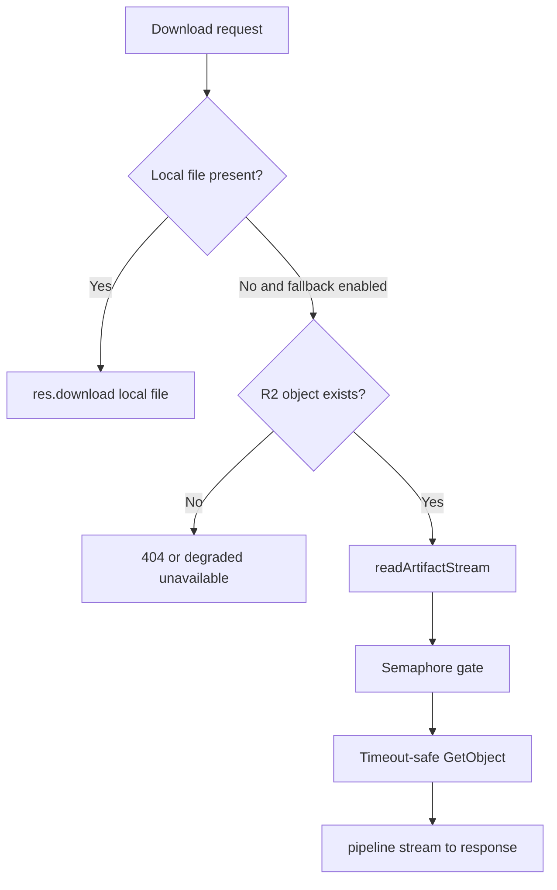

# System Map — Final Runtime Architecture

## Runtime Ownership

- API owns request/response routing, auth, validation, download endpoints, fallback resolution, telemetry emission.
- Worker owns async job execution, rendering, artifact creation, and optional async R2 mirror upload.
- Queue ownership is BullMQ-backed: API enqueues, worker consumes, API reads job state/results.

## Storage Abstraction Layer

- `apps/api/src/storage/provider.ts`
  - Local provider is authoritative write target.
  - Optional async dual-write to R2 when flags are enabled.
  - Unified R2 env credential resolution via alias-aware resolver from `config.ts`.

- `apps/api/src/storage/paths.ts`
  - Local-first file polling (`waitForStoredFileWithFallback`).
  - Fallback to R2 only when dual-read and R2 upload flags are enabled.
  - Fast R2 existence probe with timeout-safe degraded fallback to local-not-found behavior.

- `apps/api/src/storage/R2StorageProvider.ts`
  - Streaming read path with semaphore protection and timeout wrapper.
  - Buffered read API still exists for non-download legacy/internal usages.

## Download Architecture (Streaming-Safe)

- Label and money-order fallback downloads are streaming-safe.
- No buffered `res.end(buffer)` fallback path in active download routes.
- Abort/error cleanup is in guaranteed `finally` blocks.

## Feature Flags and Runtime Intent

- `STORAGE_PROVIDER`
  - Default runtime remains local-first authoritative behavior.
  - R2-primary mode exists but is not part of staged fallback rollout plan.

- `ENABLE_DUAL_WRITE`
  - Enables async mirror upload to R2 after local write success.

- `ENABLE_DUAL_READ`
  - Enables local-miss fallback resolution path toward R2.

- `ENABLE_R2_UPLOADS`
  - Required for mirror uploads and for fallback path eligibility.

- `ENABLE_R2_DOWNLOADS`
  - Available flag in storage feature set; not required for local-first fallback route behavior.

## Observability Architecture (As Implemented)

- Telemetry (`apps/api/src/telemetry.ts`)
  - No-throw logger with bounded per-process line cap.
  - Key rollout events:
    - `dual_write_start`, `dual_write_success`, `dual_write_failure`
    - `dual_write_stream_start`, `dual_write_stream_cleanup`
    - `dual_read_fallback`, `provider_fallback`
    - `stream_start`, `stream_success`, `stream_failure`, `stream_timeout`, `stream_abort`, `stream_cleanup`
    - `concurrency_limit_hit`

- Metrics (`apps/api/src/metrics.ts`)
  - `activeR2StreamsGauge`
  - `r2StreamDuration`
  - `r2StreamFailures`
  - `r2ConcurrencyLimitHits`
  - `r2TimeoutCounter`
  - `r2FailureCounter`
  - `activeDualWritesGauge`

## Concurrency and Timeout Protections

- Stream concurrency limit: semaphore in R2 stream read path.
- Queue-hit observability: `r2ConcurrencyLimitHits` + `concurrency_limit_hit` telemetry when contention is detected.
- Timeout protection: timeout wrapper around remote object fetch.
- Degraded behavior: fallback checks fail closed to local-not-found/unavailable responses without process crash.

## Cleanup Safety Model

- Cleanup cron only removes aged orphaned files not referenced by active queue/DB state.
- With dual-write enabled, PDF deletion requires synced markers to be present.
- DB-unreachable cleanup runs are skipped safely.

## Related Operational Docs

- `docs/architecture/storage-rollout-architecture.md`
- `docs/rollout/storage-rollout-runbook.md`
- `docs/rollout/deployment-status.md`

## Login and Upload UX Runtime Behavior

- Login and dashboard bootstrap:
  - Frontend now renders shell early and hydrates `/api/me` asynchronously.
  - Post-login transition shows a full-screen handoff overlay: "Signing you in... loading dashboard".
  - `/api/me` bootstrap fetch uses shared in-memory cache + in-flight dedupe to prevent duplicate calls from auth/profile guards.

- Generate-label waiting UX:
  - Processing overlay now uses explicit pipeline stages:
    1. Uploading file
    2. Reading records
    3. Validating rows
    4. Creating preview table
    5. Preparing label job
  - Visual estimate is non-authoritative; if estimate reaches zero while backend still runs, UI switches to "Still working... checking progress".
  - Long-running processing exposes a manual "Check status" action tied to `/api/jobs/:jobId`.

- Dev-only timing instrumentation:
  - Frontend: login API timing, Google token exchange timing, session restore timing, upload stage timings, status-check timing.
  - API: login timing breakdown (`user lookup`, `password verify`, `total`) and `/api/me` timing breakdown (`user`, `subscription`, `snapshot`, `complaint allowance`, `total`).
  - Production logging remains unchanged (timing logs suppressed in production).
