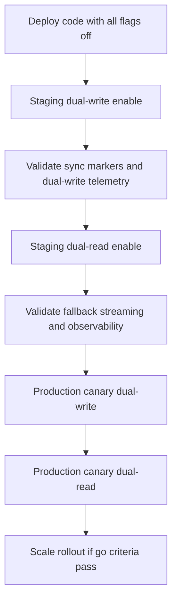

# Storage Rollout Operational Runbook

## Scope

Operational rollout and incident runbook for storage dual-write/dual-read fallback architecture.

This runbook covers:

- staging rollout
- production canary rollout
- rollback
- R2 outage handling
- degraded-mode handling
- memory-pressure incidents
- observability verification
- cleanup validation
- stream concurrency monitoring

Additionally for Aggregator Booking Phase A metadata readiness:

- additive DB metadata rollout for quote source objects and booking documents
- metadata-only API attach/list checks for aggregator booking documents
- explicit no-change boundary for generation path, cleanup cron behavior, and fallback read preference

## Preconditions

- Build passes for API and worker.
- DB reachable for normal operations.
- Redis reachable for normal queue operations.
- R2 credentials configured with supported aliases:
  - `R2_ACCESS_KEY_ID` or `R2_ACCESS_KEY`
  - `R2_SECRET_ACCESS_KEY` or `R2_SECRET_KEY`
- `R2_BUCKET` and `R2_ENDPOINT` configured.

## Staging Frontend Verification

When testing the local frontend against staging Api-staging, set an explicit allowlist via `CORS_ALLOWED_ORIGINS` and keep the scope limited to local verification only.

- Use `CORS_ALLOWED_ORIGINS=http://localhost:5173,http://127.0.0.1:5173` in staging only when you need the local frontend to call Api-staging.
- This is for staging/local verification only.
- Keep `ENABLE_UPLOAD_LOCAL_CLEANUP_AFTER_R2=false` and `ENABLE_R2_PREFERRED_READS=false` until Phase B passes.
- Phase B verification still requires login, upload, `LabelJob` creation, `R2_SYNCED` SQL evidence, and R2 object confirmation.

## ComplaintQueue Recovery Note

If Api-staging fails with `prisma.complaintQueue.findMany()` and `public.ComplaintQueue` is missing, add only the smallest additive Prisma migration that creates `ComplaintQueue` to match [apps/api/prisma/schema.prisma](../../apps/api/prisma/schema.prisma).

- Do not modify production.
- Do not use destructive database commands.
- Do not change upload, R2, or LabelJob logic.
- Keep the migration additive only.

## Infrastructure Bootstrap Checklist

Before S0, confirm the environment is operational enough to distinguish rollout defects from missing infrastructure:

1. Start PostgreSQL and Redis.
2. Verify PostgreSQL is reachable on the host in `DATABASE_URL`.
3. Verify `REDIS_URL` is not missing and not a placeholder value.
4. Run API and worker once and inspect startup logs.
5. Do not begin S1 until startup logs report `FULLY_READY`.

## Startup Readiness States

- `FULLY_READY`: PostgreSQL and Redis are both reachable. Safe to proceed with S0 functional checks and later staged rollout steps.
- `DEGRADED_NO_DB`: PostgreSQL unavailable. API may bind, but DB-backed routes, plan seed, queue recovery, and worker execution are blocked.
- `DEGRADED_NO_REDIS`: Redis unavailable. API may bind, but queue recovery and BullMQ worker startup are blocked.
- `DEGRADED_NO_DB_OR_REDIS`: Both unavailable. Treat as infrastructure/bootstrap failure, not a rollout signal.

## Feature Flags (Exact)

- `STORAGE_PROVIDER`
- `ENABLE_DUAL_WRITE`
- `ENABLE_DUAL_READ`
- `ENABLE_R2_UPLOADS`
- `ENABLE_R2_DOWNLOADS`
- `ENABLE_UPLOAD_R2_BACKUP` — Phase B: enables R2 durable backup of uploaded CSV/XLSX source files (default: off)
- `ENABLE_UPLOAD_LOCAL_CLEANUP_AFTER_R2` — Phase C: enables local upload file cleanup only after confirmed R2 sync (default: off)
- `ENABLE_R2_PREFERRED_READS` — Phase D: enables controlled R2-preferred read behavior with mandatory local fallback (default: off)
- `FORCE_LOCAL_READS` — Phase D emergency override to force local-first reads (default: off)

## Default Safe Baseline

- Keep all rollout flags disabled by default.
- Keep `STORAGE_PROVIDER=local` for local-first authoritative behavior.

## Aggregator Phase A Boundary Rules

- Do not modify `apps/api/src/routes/jobs.ts` generation/upload path.
- Do not change cleanup deletion decisions in `apps/api/src/cron/cleanup.ts`.
- Do not switch read preference to remote-first.
- Do not alter worker execution flow for label/MO generation.
- Treat Phase A as schema/API metadata capture only.

## Phase B: Upload Source File R2 Backup

### Purpose
Phase B makes initial CSV/XLSX uploads durable in Cloudflare R2 immediately after the multer disk write and before the BullMQ enqueue. This decouples source file durability from the generated-artifact dual-write pipeline.

### Feature Flag
`ENABLE_UPLOAD_R2_BACKUP=true` to activate. Off by default — zero behavior change when unset.

### Invariants
- Local `uploadPath` remains backward-compatible and authoritative.
- Local file deletion is NOT enabled in Phase B. Phase C will handle local cleanup only after confirmed R2 sync.
- R2 read preference is NOT changed in Phase B. Workers continue to read from local disk. Phase D will add R2-preferred reads.
- R2 upload failure does not stop job creation. Job proceeds with `uploadSyncStatus=FAILED`.

### R2 Key Format
`uploads/{env}/{jobId}/source{ext}` — e.g. `uploads/production/uuid/source.csv`

### Phase B Rollout Procedure

1. Deploy with `ENABLE_UPLOAD_R2_BACKUP=false` (default). Confirm baseline behavior unchanged.
2. Set `ENABLE_UPLOAD_R2_BACKUP=true` in staging. Upload a CSV. Confirm:
   - `uploadSyncStatus = R2_SYNCED` on the LabelJob row.
   - R2 object visible in bucket under `uploads/{env}/{jobId}/source.csv`.
   - Job completes normally with label PDF generated.
3. Simulate R2 credential failure (wrong key). Confirm:
   - `uploadSyncStatus = FAILED` logged in DB.
   - Telemetry event `upload_r2_backup_failed` emitted.
   - Job still completes successfully from local file.
4. Enable in production after staging validation passes.

### Staging Local Frontend Note

If the operator uses a local frontend for staging verification, the browser origin must be explicitly allowlisted with `CORS_ALLOWED_ORIGINS` so the login flow can reach `/api/auth/firebase-login`.

- Do not use a wildcard CORS policy.
- Do not broaden production origins beyond the explicit list.
- Do not enable cleanup or R2-preferred reads before Phase B is verified.

### Phase B Boundary Rules
- Do NOT set `DELETE_LOCAL_AFTER_R2_SYNC` for upload source files in Phase B.
- Do NOT change `uploadPath` handling in `deleteJobArtifacts`.
- Do NOT change worker `filePath` / `fileBuffer` queue payload.
- Phase B touches ONLY: `schema.prisma`, migration SQL, `key-normalization.ts`, `provider.ts`, `jobs.ts` (one gated block).

## Phase C: Safe Local Upload Cleanup After Confirmed R2 Sync

### Purpose
Phase C safely deletes local uploaded CSV/XLSX files only after R2 sync is confirmed and metadata is persisted.

### Feature Flag and Envs
- `ENABLE_UPLOAD_LOCAL_CLEANUP_AFTER_R2=true`
- `UPLOAD_LOCAL_CLEANUP_GRACE_MS` (default `3600000`, minimum `60000`)
- `UPLOAD_LOCAL_CLEANUP_MAX_ATTEMPTS` (default `5`)

### Eligibility Rules
Delete local upload file only when:
- `uploadSyncStatus = R2_SYNCED`
- `uploadObjectKey` exists
- `uploadPath` exists
- `uploadSyncedAt` older than grace period
- local cleanup not already completed
- retry schedule due and attempts below max

### Path Safety Rules
- Resolve upload path to canonical absolute path.
- Resolve uploads root to canonical absolute path.
- Ensure target remains inside uploads root boundary.
- Reject path traversal.
- Reject symlink targets.
- Reject directories.
- Delete regular files only.

### Cleanup Statuses
- `PENDING`
- `COMPLETED`
- `RETRY_PENDING`
- `FAILED_TERMINAL`
- `SKIPPED_UNSAFE_PATH`
- `SKIPPED_MISSING_FILE`

### Retry Behavior
- On delete failure: increment attempts, set `uploadLocalCleanupLastError`, set `RETRY_PENDING`, schedule `uploadLocalCleanupNextRetryAt` with backoff.
- On max attempts: set `FAILED_TERMINAL` and stop retrying until manual reset.

### Invariants
- No R2 read preference change in Phase C.
- No queue payload shaping change in Phase C.
- No generated PDF/MO/tracking download behavior change in Phase C.
- Phase D will handle R2-preferred reads later.

### Rollback
Set `ENABLE_UPLOAD_LOCAL_CLEANUP_AFTER_R2=false` to stop further local cleanup immediately.

## Phase D: Controlled R2-Preferred Reads With Mandatory Local Fallback

### Purpose
Enable R2-preferred reads only when explicitly flagged on, while preserving local fallback for compatibility and rollback safety.

### Invariants
- R2-only read is NOT enabled.
- Local fallback is mandatory.
- Existing route contracts (status codes, messages, attachment names/content types) remain unchanged.
- No queue payload change, no generation-logic change, and no cleanup deletion behavior change in Phase D.

### Flag Behavior
1. If `FORCE_LOCAL_READS=true`, skip R2-preferred logic and use local-first behavior.
2. Else if `ENABLE_R2_PREFERRED_READS=true` and durable metadata is present, attempt R2 first.
3. On R2 miss/failure/timeout, fallback to local.
4. If both fail, preserve existing route error behavior.

### Observability
Emit route-level read outcome telemetry:
- `r2_read_success`
- `r2_read_failed_fallback_local`
- `local_fallback_success`
- `local_fallback_failed`
- `local_read_success`

Each event should include route, artifact type, job id where available, preferred mode flag, and force-local flag.

### Rollout Sequence
1. Local/dev baseline: `ENABLE_R2_PREFERRED_READS=false` and `FORCE_LOCAL_READS=false`.
2. Staging: enable `ENABLE_R2_PREFERRED_READS=true` with `FORCE_LOCAL_READS=false`.
3. Monitor 404/502 rates, stream failures, and latency.
4. Production canary: limited window with close telemetry watch.
5. Broader rollout only after canary stability.

### Emergency Rollback
Use either:
- `ENABLE_R2_PREFERRED_READS=false` (primary rollback), or
- `FORCE_LOCAL_READS=true` (immediate hard override).

Phase D does not alter cleanup deletion and does not add R2-only read mode.

## Rollout Sequence

## Staging Rollout Procedure

### Phase S0: No-Flag Baseline

1. Deploy latest build with flags off.
2. Confirm API and worker startup logs report `FULLY_READY`.
3. Confirm local-only behavior remains unchanged.
4. Confirm no startup validation failures.

### S0 Go/No-Go Interpretation

- `FULLY_READY`: continue to S0 smoke validation and only then consider S1.
- Any `DEGRADED_*` state: stop, fix infrastructure first, and re-run S0 baseline validation.

### Phase S1: Enable dual-write mirror

1. Set:
   - `ENABLE_DUAL_WRITE=true`
   - `ENABLE_R2_UPLOADS=true`
2. Keep:
   - `ENABLE_DUAL_READ=false`
3. Validate:
   - uploads complete
   - local artifacts present
   - R2 mirror uploads successful
   - sync markers updated
4. Verify telemetry:
   - `dual_write_start`
   - `dual_write_stream_start`
   - `dual_write_success`
   - `dual_write_stream_cleanup`

### Phase S2: Enable dual-read fallback

1. Set:
   - `ENABLE_DUAL_READ=true`
2. Keep `STORAGE_PROVIDER=local`.
3. Force local-miss test for controlled artifacts.
4. Verify fallback streaming path from R2:
   - labels
   - money-order PDFs
5. Verify telemetry:
   - `dual_read_fallback`
   - `provider_fallback`
   - `stream_start`
   - `stream_success`
   - `stream_cleanup`

### Phase S3: Stress and edge validation

1. Run concurrent fallback downloads.
2. Confirm semaphore behavior and queue-hit detection.
3. Confirm no leaked active stream gauges after abort/error.
4. Confirm cleanup safety when dual-write enabled.

## Production Canary Rollout Procedure

### Canary P0: Deploy with flags off

- Confirm baseline parity with pre-rollout behavior.

### Canary P1: Limited dual-write enable

1. Enable dual-write + R2 uploads for a controlled period.
2. Monitor:
   - upload success/failure rates
   - sync marker update health
   - active dual-write gauge cleanup behavior

### Canary P2: Limited dual-read enable

1. Enable dual-read on canary slice.
2. Monitor:
   - fallback success/failure/timeout/abort rates
   - stream cleanup consistency
   - memory and process stability

### Canary P3: Expand or rollback decision

- Expand only if go criteria pass for the observation window.

## Rollback Procedure

### Immediate rollback (flags)

1. Set `ENABLE_DUAL_READ=false`.
2. Set `ENABLE_DUAL_WRITE=false` if mirror path must stop.
3. Set `ENABLE_R2_UPLOADS=false` if R2 path must fully disable.
4. Restart affected services.

### Post-rollback validation

- local-only downloads work
- new jobs complete
- no unresolved queue failures
- no startup validation errors

## R2 Outage Handling Runbook

### Symptoms

- rising `stream_failure` or `stream_timeout`
- `provider_fallback` errors
- dual-write failure spikes

### Actions

1. Disable fallback read path first: `ENABLE_DUAL_READ=false`.
2. If required, disable mirror writes: `ENABLE_DUAL_WRITE=false` and `ENABLE_R2_UPLOADS=false`.
3. Keep local authoritative path active.
4. Verify service stability and customer-facing download recovery.

### Recovery

1. Restore R2 connectivity.
2. Re-enable flags in staged order (dual-write first, then dual-read).

## Degraded-Mode Handling Runbook

### Expected degraded behavior

- R2 existence probes fail closed.
- API remains available.
- local-first behavior remains authoritative.
- fallback responses return normal not-found/unavailable outcomes when remote not usable.

### Operator checklist

- confirm no crash loops
- confirm local downloads succeed
- verify fallback errors are observable via telemetry

## Memory-Pressure Incident Runbook

### Primary signals

- elevated heap usage
- process restarts or OOM indicators
- high concurrent fallback stream load

### Actions

1. Verify stream routes are active (not buffered fallback paths).
2. Reduce fallback pressure by disabling `ENABLE_DUAL_READ` temporarily.
3. Inspect stream telemetry and timeout/failure ratios.
4. Verify active stream gauge returns to baseline after load subsides.

### Recovery criteria

- heap stabilizes
- no OOM/restart loop
- stream cleanup telemetry confirms closure

## Observability Verification Runbook

### Metrics checklist

- `activeR2StreamsGauge`
- `r2StreamDuration`
- `r2StreamFailures`
- `r2ConcurrencyLimitHits`
- `r2TimeoutCounter`
- `r2FailureCounter`
- `activeDualWritesGauge`

### Telemetry checklist

- dual-write events:
  - `dual_write_start`
  - `dual_write_stream_start`
  - `dual_write_success`
  - `dual_write_failure`
  - `dual_write_stream_cleanup`
- dual-read/fallback events:
  - `dual_read_fallback`
  - `provider_fallback`
- stream lifecycle:
  - `stream_start`
  - `stream_success`
  - `stream_failure`
  - `stream_timeout`
  - `stream_abort`
  - `stream_cleanup`
- contention visibility:
  - `concurrency_limit_hit`

## Cleanup Validation Runbook

### Validate sync-aware deletion behavior

1. With dual-write enabled, verify unsynced PDFs are not deleted by cleanup.
2. Verify synced PDFs become eligible according to retention logic.
3. Confirm no active queue/job artifacts are removed.
4. Confirm scheduled deletions remove files and DB rows consistently.

### Failure-mode checks

- DB unavailable cleanup run should skip safely.
- No destructive behavior on temporary connectivity issues.

## Stream Concurrency Monitoring Runbook

### What to watch

- active stream snapshots from `stream_start` and `stream_cleanup`
- `r2ConcurrencyLimitHits`
- `concurrency_limit_hit` event rate
- timeout/failure ratios under concurrency

### Go/No-Go thresholds (operator-defined)

- Go when:
  - stream cleanup returns gauges to baseline
  - timeout/failure rates remain within acceptable operational threshold
  - no memory instability under representative load
- No-Go when:
  - persistent gauge leak is observed
  - repeated timeout storms under normal load
  - user-visible download failure rate exceeds threshold

## Canary Go/No-Go Criteria

### Go

- startup validation passes with configured aliases
- dual-write success is stable
- fallback streaming success is stable
- no gauge leaks
- cleanup safety checks pass

### No-Go

- startup credential validation mismatch
- unresolved stream failures/timeouts under normal load
- memory instability or restart loops
- cleanup deletes unsynced artifacts

## Final Operator Notes

- Do not enable all rollout flags at once.
- Preserve local-first authoritative design throughout staged rollout.
- Prefer rollback via flags before code rollback.
- Keep architecture and runbook docs in sync with deployed behavior.
